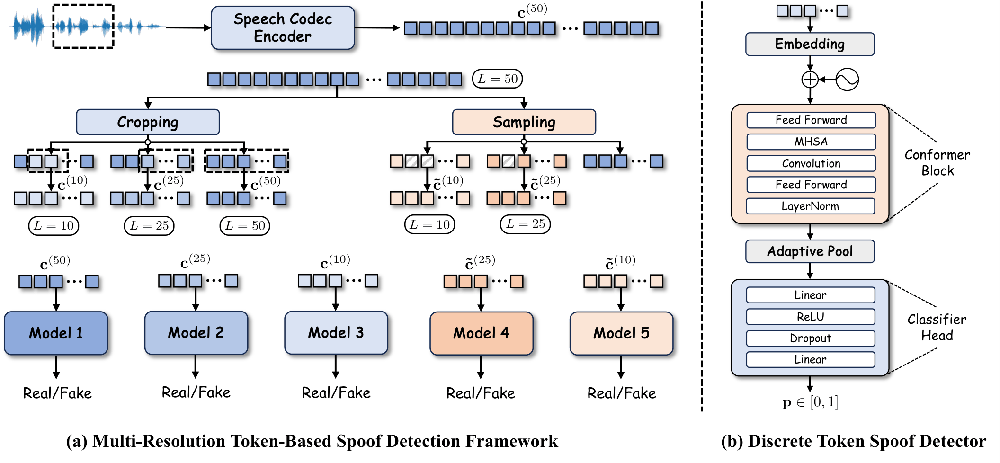

<p align="center">
  
</p>

<h1 align="center">MSpoofTTS</h1>

---

<h2 align="center"><em>Hierarchical Decoding for Discrete Speech Synthesis with Multi-Resolution Spoof Detection</em></h2>

<p align="center">
  <a href="https://www.interspeech2026.org/"></a>
  <a href="https://arxiv.org/pdf/2603.05373"></a>
  <a href="https://danny-nus.github.io/MSpoofTTS.github.io/"></a>
  <a href="https://github.com/neuphonic/neutts"></a>
  <a href="LICENSE"></a>
</p>

<p align="center">
  <a href="https://arxiv.org/pdf/2603.05373">Paper</a> | <a href="https://danny-nus.github.io/MSpoofTTS.github.io/">Demo</a>
</p>

## Overview

Neural codec language models can synthesize high-quality speech, but inference in the discrete token space is still vulnerable to token-level artifacts and distribution drift. MSpoofTTS is a training-free inference framework that improves zero-shot speech synthesis with multi-resolution spoof guidance. It evaluates codec-token sequences at multiple temporal granularities to identify locally inconsistent or unnatural patterns, then integrates the resulting authenticity scores into hierarchical decoding to prune weak candidates and rerank hypotheses. The base NeuTTS language model is kept fixed; robustness is improved without retraining or changing its parameters.

<p align="center">
  
</p>

## News

- **2026.06**: MSpoofTTS is accepted to INTERSPEECH 2026.
- **2026.04**: arXiv v2 released: [2603.05373](https://arxiv.org/abs/2603.05373).
- **2026.03**: Demo page with audio samples is available: [MSpoofTTS demo](https://danny-nus.github.io/MSpoofTTS.github.io/).

## Setup

```bash
git clone https://github.com/Danny-NUS/MSpoofTTS.git
cd MSpoofTTS

conda create -n mspooftts python=3.11 -y
conda activate mspooftts

# NeuTTS requires espeak-ng for phonemization.
brew install espeak-ng        # macOS
# sudo apt install espeak-ng  # Ubuntu/Debian

pip install -r requirements.txt
```

Optional backends:

```bash
pip install llama-cpp-python  # GGUF backbone support
pip install onnxruntime       # ONNX codec decoder support
```

## Inference

The default example runs vanilla NeuTTS sampling:

```bash
python -m examples.basic_example \
  --input_text "MSpoofTTS improves codec-token speech synthesis at inference time." \
  --ref_audio samples/jo.wav \
  --ref_text samples/jo.txt \
  --output_path output.wav
```

Run MSpoofTTS-guided decoding by selecting `rank_eas_hier`. The discriminator checkpoints are downloaded automatically from [Chanson-0803/MSpoofTTS](https://huggingface.co/Chanson-0803/MSpoofTTS):

```bash
python -m examples.basic_example \
  --input_text "MSpoofTTS improves codec-token speech synthesis at inference time." \
  --ref_audio samples/jo.wav \
  --ref_text samples/jo.txt \
  --sampling_scheme rank_eas_hier \
  --backbone_device cuda \
  --codec_device cuda \
  --output_path output_mspooftts.wav
```

Python usage:

```python
from neutts import NeuTTS
import soundfile as sf

tts = NeuTTS(
    backbone_repo="neuphonic/neutts-nano",
    backbone_device="cuda",
    codec_repo="neuphonic/neucodec",
    codec_device="cuda",
    use_hier=True,
    discriminator_repo="Chanson-0803/MSpoofTTS",
)

ref_text = open("samples/jo.txt", encoding="utf-8").read().strip()
ref_codes = tts.encode_reference("samples/jo.wav")

wav = tts.infer(
    "MSpoofTTS uses multi-resolution spoof scores during decoding.",
    ref_codes,
    ref_text,
    sampling_scheme="rank_eas_hier",
)
sf.write("output_mspooftts.wav", wav, 24000)
```

Supported PyTorch decoding schemes:

| Scheme          | Description                                                           |
| --------------- | --------------------------------------------------------------------- |
| `orig`          | Original NeuTTS top-k sampling baseline.                              |
| `eas`           | Entropy-Aware Sampling without discriminator reranking.               |
| `rank_eas_hier` | MSpoofTTS hierarchical decoding with multi-resolution spoof guidance. |

## What We Modified

This repository is based on NeuTTS. The upstream NeuTTS runtime is kept as the base system; MSpoofTTS additions are marked as `(new)` below and in code comments where they are mixed into existing files. The `neutts/` directory is therefore **modified upstream code**, not a fully new package.

- **(new)** `Discriminator/`: multi-resolution token spoof detector modules used by guided decoding.
- **(new)** `mspooftts/`: Hugging Face checkpoint loading utilities for MSpoofTTS discriminator checkpoints.
- **(new)** `rank_eas_hier` in `neutts/neutts.py`: Entropy-Aware Sampling plus hierarchical discriminator pruning/reranking.
- **(new)** CLI flags in `examples/basic_example.py`: `--sampling_scheme`, `--backbone_device`, `--codec_device`, and `--discriminator_repo`.

### New Code Mixed Into `neutts/neutts.py`

The original NeuTTS logic for phonemization, backbone loading, codec loading, reference encoding, decoding, streaming, and vanilla `orig` generation is kept as the base. The MSpoofTTS additions inside this file are:

- **(new)** imports for `Discriminator` and `mspooftts.checkpoints`.
- **(new)** `nucleus_sampling` and `EASPenalty`, used by EAS-based decoding.
- **(new)** optional constructor arguments: `use_dis`, `use_hier`, `discriminator_repo`, and `discriminator_revision`.
- **(new)** lazy discriminator loading when `use_dis=True` or `use_hier=True`.
- **(new)** speech-token helpers: `_mask_to_speech_only` and `_lm_to_speech_id_or_none`.
- **(new)** `_eas_generate`, `_rank_sum_select`, and `_rank_eas_hier_generate`.
- **(new)** `sampling_scheme` routing in `infer` / `_infer_torch`; `orig` remains the NeuTTS baseline path.

## Repository Layout

```text
TTSSpoofDetection/
├── assets/                 # (new) README figures and project icon
├── Discriminator/          # (new) MSpoofTTS discriminator modules used at inference
├── examples/               # Minimal command-line inference examples
├── mspooftts/              # (new) MSpoofTTS checkpoint loading utilities
├── neutts/                 # modified NeuTTS runtime; new hooks marked in neutts.py
├── neuttsair/              # NeuTTS-Air compatibility wrapper
├── samples/                # Reference audio/text/code samples
├── tests/                  # Lightweight loading/inference smoke tests
├── README.md
├── LICENSE
├── LICENSE_APACHE
└── requirements.txt
```

## Citation

If you use MSpoofTTS, please cite our paper. Since this repository builds on NeuTTS/NeuCodec components, please also cite NeuCodec when using the codec.

```bibtex
@article{zhao2026hierarchical,
  title={Hierarchical Decoding for Discrete Speech Synthesis with Multi-Resolution Spoof Detection},
  author={Zhao, Junchuan and Vu, Minh Duc and Wang, Ye},
  journal={arXiv preprint arXiv:2603.05373},
  year={2026}
}

@article{julian2025finite,
  title={Finite Scalar Quantization Enables Redundant and Transmission-Robust Neural Audio Compression at Low Bit-rates},
  author={Julian, Harry and Beeson, Rachel and Konathala, Lohith and Ulin, Johanna and Gao, Jiameng},
  journal={arXiv preprint arXiv:2509.09550},
  year={2025}
}
```

## License

This repository contains two license scopes:

- **NeuTTS-derived code and model usage**: NeuTTS Open License v1.0 — see `LICENSE`.
- **MSpoofTTS source code** outside the original NeuTTS codebase, including `Discriminator/`, `mspooftts/`, README assets, and the marked `(new)` inference hooks in `neutts/neutts.py`: Apache-2.0 — see `LICENSE_APACHE`.

The MSpoofTTS discriminator checkpoints are hosted at [Chanson-0803/MSpoofTTS](https://huggingface.co/Chanson-0803/MSpoofTTS). Please also follow the license and terms on that Hugging Face repository when using the checkpoints.
